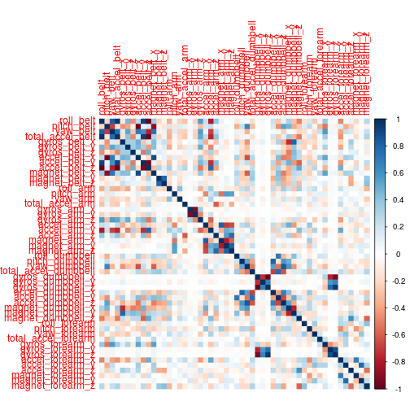
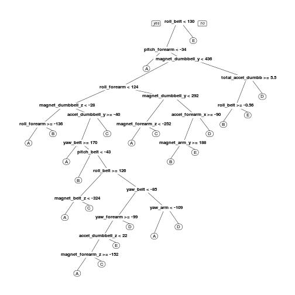

## Introduction  
Using devices such as Jawbone Up, Nike FuelBand, and Fitbit it is now possible to collect a large amount of data about personal activity relatively inexpensively. These type of devices are part of the quantified self movement – a group of enthusiasts who take measurements about themselves regularly to improve their health, to find patterns in their behavior, or because they are tech geeks. One thing that people regularly do is quantify how much of a particular activity they do, but they rarely quantify how well they do it.  

In this project, we will use data from accelerometers on the belt, forearm, arm, and dumbell of 6 participants to predict the manner in which they did the exercise.  

## Load Libraries 

```r
library(caret)
library(rpart)
library(rpart.plot)
library(randomForest)
library(corrplot)
```

### Read the Data

```r
trainRaw <- read.csv("pml-training.csv")
testRaw <- read.csv("pml-testing.csv")
dim(trainRaw)
```

```
## [1] 19622   160
```

```r
dim(testRaw)
```

```
## [1]  20 160
```
The training data set contains 19622 observations and 160 variables, while the testing data set contains 20 observations and 160 variables. The "classe" variable in the training set is the outcome to predict. 

### Cleanning the data

```r
sum(complete.cases(trainRaw))
```

```
## [1] 406
```

### Removing missing data

```r
trainRaw <- trainRaw[, colSums(is.na(trainRaw)) == 0] 
testRaw <- testRaw[, colSums(is.na(testRaw)) == 0] 
```
  

```r
classe <- trainRaw$classe
trainRemove <- grepl("^X|timestamp|window", names(trainRaw))
trainRaw <- trainRaw[, !trainRemove]
trainCleaned <- trainRaw[, sapply(trainRaw, is.numeric)]
trainCleaned$classe <- classe
testRemove <- grepl("^X|timestamp|window", names(testRaw))
testRaw <- testRaw[, !testRemove]
testCleaned <- testRaw[, sapply(testRaw, is.numeric)]
```

### Slice the data
Spliting cleaned traning dataset in ratio of 0.7 and 0.3 for pure traning and validation purposes respectively.  

```r
set.seed(100000) 
inTrain <- createDataPartition(trainCleaned$classe, p=0.70, list=FALSE)
trainData <- trainCleaned[inTrain, ]
testData <- trainCleaned[-inTrain, ]
```

## Data Modeling
The Predictive Model for activity recognition uses Random Forest algorithm because it automatically selects important variables and is robust to correlated covariates & outliers. The 5-fold cross validation when applying the algorithm.  

```r
controlRf <- trainControl(method="cv",number = 5)
modelRf <- train(classe ~ ., data=trainData, method="rf", trControl=controlRf, ntree=250)
modelRf
```

```
## Random Forest 
## 
## 13737 samples
##    52 predictors
##     5 classes: 'A', 'B', 'C', 'D', 'E' 
## 
## No pre-processing
## Resampling: Cross-Validated (5 fold) 
## Summary of sample sizes: 10991, 10988, 10989, 10991, 10989 
## Resampling results across tuning parameters:
## 
##   mtry  Accuracy   Kappa    
##    2    0.9879891  0.9848033
##   27    0.9892265  0.9863690
##   52    0.9836212  0.9792791
## 
## Accuracy was used to select the optimal model using  the largest value.
## The final value used for the model was mtry = 27.
```
Estimating the performance of the model on the validation data set.  

```r
predictRf <- predict(modelRf, testData)
confusionMatrix(testData$classe, predictRf)
```

```
## Confusion Matrix and Statistics
## 
##           Reference
## Prediction    A    B    C    D    E
##          A 1669    1    4    0    0
##          B    9 1129    1    0    0
##          C    0    9 1014    3    0
##          D    0    0   11  952    1
##          E    0    1    0    5 1076
## 
## Overall Statistics
##                                           
##                Accuracy : 0.9924          
##                  95% CI : (0.9898, 0.9944)
##     No Information Rate : 0.2851          
##     P-Value [Acc > NIR] : < 2.2e-16       
##                                           
##                   Kappa : 0.9903          
##  Mcnemar's Test P-Value : NA              
## 
## Statistics by Class:
## 
##                      Class: A Class: B Class: C Class: D Class: E
## Sensitivity            0.9946   0.9904   0.9845   0.9917   0.9991
## Specificity            0.9988   0.9979   0.9975   0.9976   0.9988
## Pos Pred Value         0.9970   0.9912   0.9883   0.9876   0.9945
## Neg Pred Value         0.9979   0.9977   0.9967   0.9984   0.9998
## Prevalence             0.2851   0.1937   0.1750   0.1631   0.1830
## Detection Rate         0.2836   0.1918   0.1723   0.1618   0.1828
## Detection Prevalence   0.2845   0.1935   0.1743   0.1638   0.1839
## Balanced Accuracy      0.9967   0.9941   0.9910   0.9946   0.9989
```

```r
accuracy <- postResample(predictRf, testData$classe)
accuracy
```

```
##  Accuracy     Kappa 
## 0.9923534 0.9903272
```

```r
oose <- 1 - as.numeric(confusionMatrix(testData$classe, predictRf)$overall[1])
oose
```

```
## [1] 0.007646559
```
The estimated accuracy of the model is 99.23% and the estimated out-of-sample error is 0.77%.

## Predicting for Test Data Set

```r
result <- predict(modelRf, testCleaned[, -length(names(testCleaned))])
result
```

```
##  [1] B A B A A E D B A A B C B A E E A B B B
## Levels: A B C D E
```

## Appendix: Figures

Correlation Matrix Visualization  

```r
corrPlot <- cor(trainData[, -length(names(trainData))])
corrplot(corrPlot, method="color")
```



Decision Tree Visualization

```r
treeModel <- rpart(classe ~ ., data=trainData, method="class")
prp(treeModel) # fast plot
```


